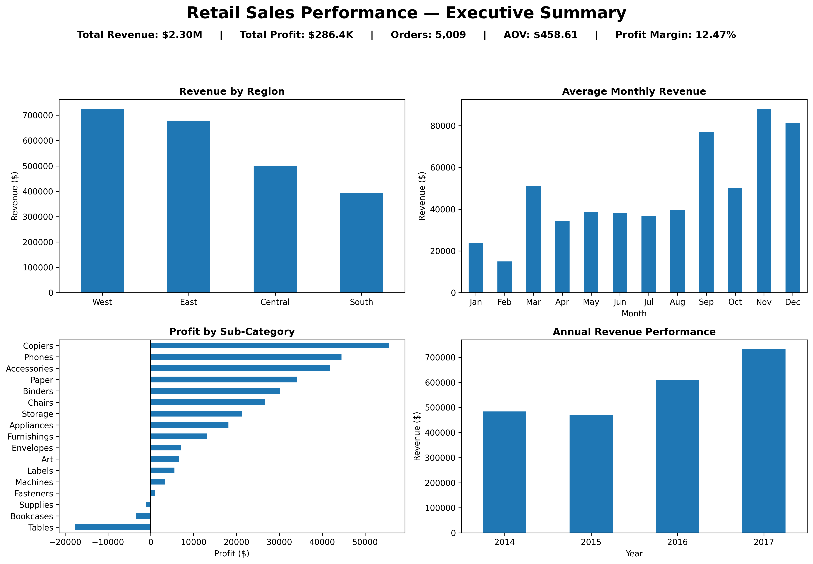

# 📊 Retail Sales Performance Analysis

### Syntecxhub Data Science Internship — Task 4

## 📌 Project Overview

This project analyzes retail sales data to evaluate business performance, identify sales trends, examine product and regional performance, and generate actionable business recommendations.

The analysis covers sales data from **2014 to 2017**.

## 🎯 Objectives

- Calculate key business KPIs
- Identify top-performing products and regions
- Analyze monthly sales trends and seasonality
- Evaluate category and sub-category profitability
- Examine the relationship between discounts and profitability
- Analyze annual revenue and profit growth
- Generate business insights and recommendations
- Create a one-page executive visual summary

## 🛠️ Tools & Technologies

- Python
- Pandas
- NumPy
- Matplotlib
- Seaborn
- Google Colab

## 📊 Key KPIs

- **Total Revenue:** $2.30M
- **Total Profit:** $286.4K
- **Total Orders:** 5,009
- **Average Order Value:** $458.61
- **Total Units Sold:** 37,873
- **Overall Profit Margin:** 12.47%

## 🔍 Key Insights

- The **West region** generated the highest revenue at approximately **$725.5K**.
- **Technology** was the strongest category, generating approximately **$836.2K revenue** and **$145.5K profit**.
- The **Canon imageCLASS 2200 Advanced Copier** was the highest-revenue individual product.
- **November, December, and September** showed the strongest average monthly sales.
- **Tables** were the largest loss-making sub-category, recording approximately **$17.7K in losses**.
- Discount levels of **30% and above** were associated with negative aggregate profit margins in this dataset.
- Revenue increased strongly during 2016 and 2017, reaching approximately **$733.2K in 2017**.

## 💡 Business Recommendations

- Strengthen sales and retention strategies in high-performing regions.
- Prioritize profitable categories such as Technology and Office Supplies.
- Review pricing, costs, and discounting for Tables and Bookcases.
- Evaluate aggressive discounting using profitability as well as revenue.
- Prepare inventory and marketing plans ahead of high-demand months.
- Continue monitoring revenue growth, profit growth, and profit margins.

## 📁 Repository Files

- `Syntecxhub_Task4_Retail_Sales_Analysis.ipynb` — Complete analysis notebook
- `Sample_Superstore.csv` — Retail sales dataset
- `Retail_Sales_One_Page_Summary.png` — Executive visual summary

## 📈 Executive Summary

## 📌 Conclusion

The project demonstrates how retail transaction data can be transformed into meaningful business insights for sales planning, profitability management, inventory preparation, and discount strategy.

---

**Internship:** Syntecxhub Data Science Internship  
**Task:** Task 4 — Retail Sales Analysis
